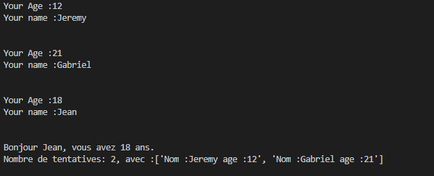

## Challenges
> Challenges de validation

Challenges de validation de niveau.

Challenge 1:



Challenge 2:


Challenge 3:


## Installation

Windows:

```sh
Download files
```
Linux:

```sh
Download files
```


## Content
* Challenge 1
* Challenge 2
* Challenge 3


## Meta

Ph3nX-Z : pythons

[https://github.com/Ph3nX-Z/](https://github.com/Ph3nX-Z/)


## Contributing

1. Fork it (<https://github.com/yourname/yourproject/fork>)
2. Create your feature branch (`git checkout -b feature/fooBar`)
3. Commit your changes (`git commit -am 'Add some fooBar'`)
4. Push to the branch (`git push origin feature/fooBar`)
5. Create a new Pull Request
